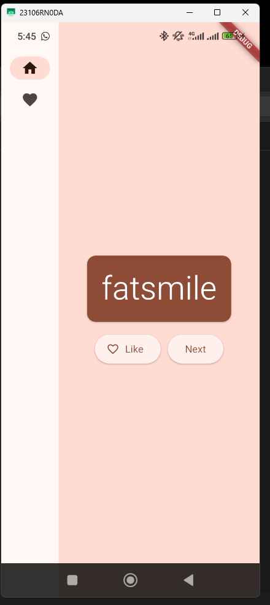
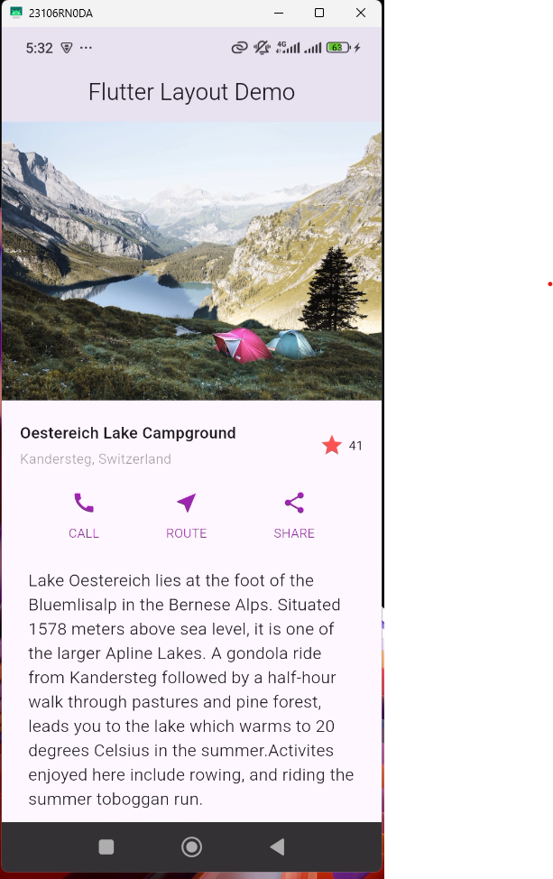
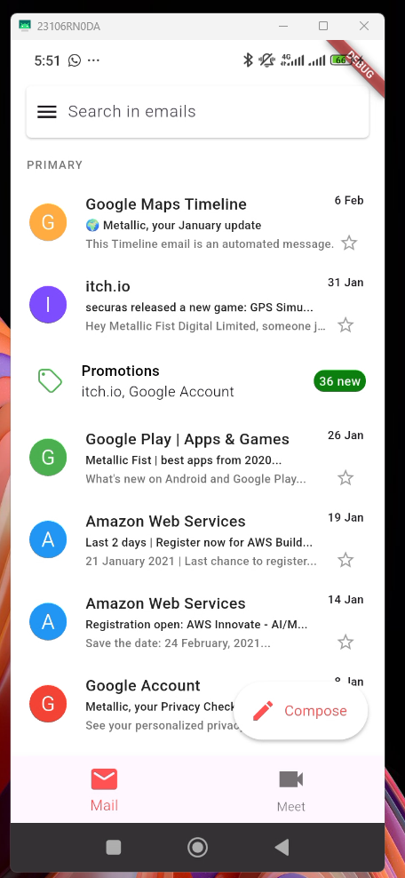
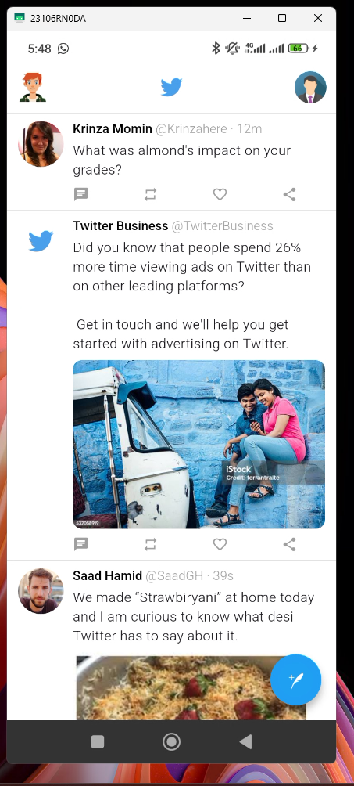
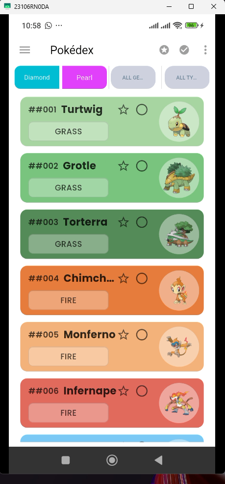

# 📱 Assignment #1 - UI Composition  
### Group No. 1

---

### 👨‍💻 Group Members:

- **Arsalan Ayaz** - 2280139  
- **Mirza Usman Baig** - 2280148  
- **Rafay Hussain** - 2280157

---

## 📦 Projects Included

### 🔹 Part 1 - First Flutter App (`namer_app/`)
Tutorial project for learning Flutter basics.

📸 **Screenshot:**


---

### 🔹 Part 2 - Flutter Layout Tutorial (`flutter_layout/`)
Tutorial project to practice layout techniques in Flutter. *(Bonus Part)*

📸 **Screenshot:**


---

### 🔹 Part 3 - Recreated UI (Chosen): **Gmail UI Clone** (`gmailUI/`)
Recreation of a Gmail mobile UI screen from the given design repo.

📸 **Screenshot:**


---

### 🔹 Part 4 - Recreated UI (Extra Work Done): **Twitter UI Clone** (`twitter_ui/`)
Assigned screen: Screenshot #2.

📸 **Screenshot:**


---

### 🔹 BONUS - DataDex UI Recreation GIVEN (`datadexui/`)
Additional bonus work – recreation of the DataDex UI screen.

📸 **Screenshot:**


---

## ✅ How to Run

Each folder is a separate Flutter project.  
To run any of the projects:

```bash
cd project_folder_name
flutter pub get
flutter run
