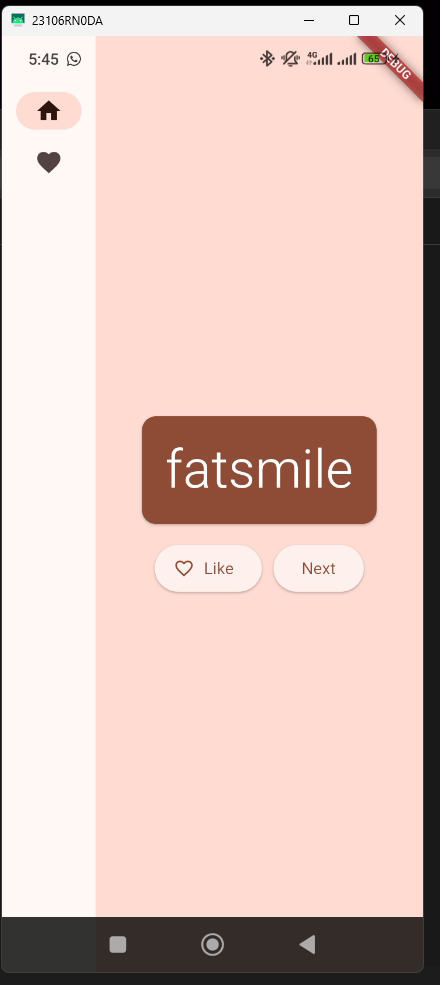
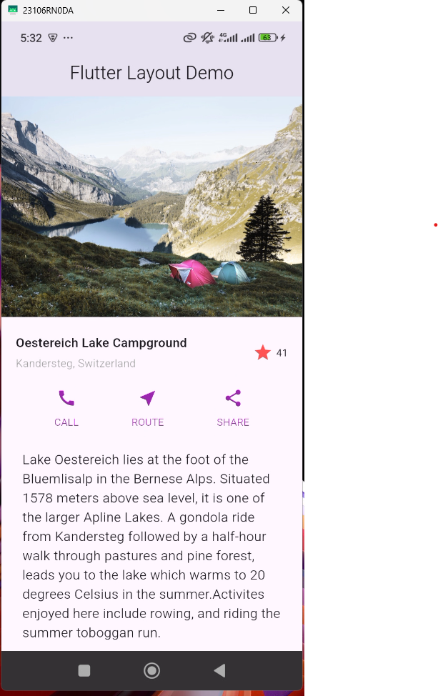
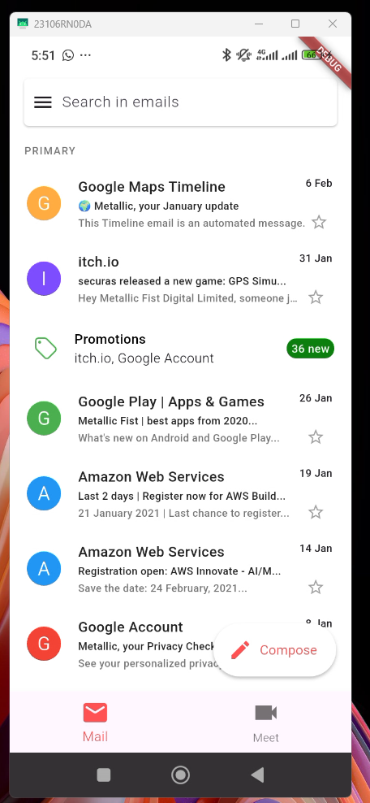
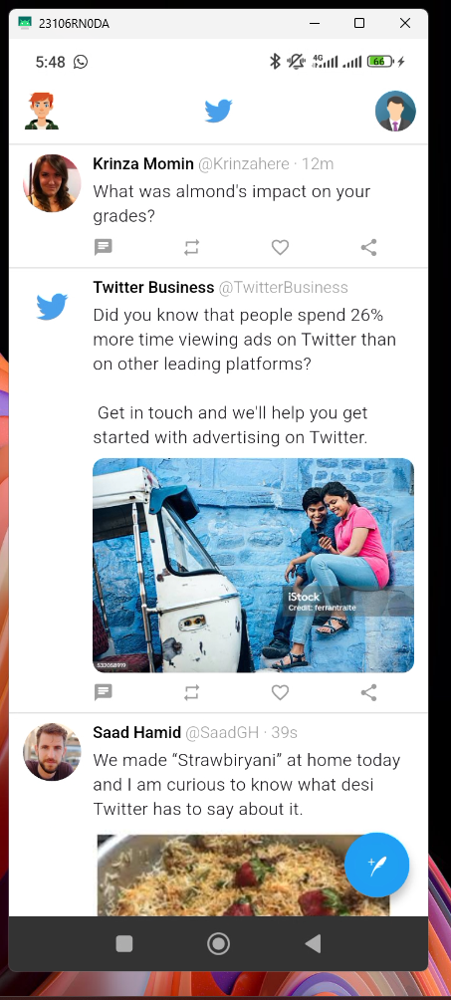

# 📱 Assignment #1 - UI Composition

**Group Number**: 1

**Members**:
- Arsalan Ayaz - 2280139  
- Mirza Usman Baig - 2280148  
- Rafay Hussain - 2280157  

------------------------------------

## 📘 Assignment Objectives

1. **Learning to use/configure Flutter and associated tools effectively.**  
2. **Learning UI layout principles by recreating given designs using Flutter.**

--------------------------------------------

## 📂 Repository Structure

This repository contains 4 Flutter projects corresponding to the 4 parts of the assignment:

| Part | Description                            | Folder Name                |
|------|----------------------------------------|----------------------------|
| 1    | First Flutter app (tutorial)           | `namer_app/`               |
| 2    | Flutter layout tutorial *(Bonus)*      | `flutter_layout/` |
| 3    | Gmail UI Clone *(Chosen Screen)*       | `gmailUI/`          |
| 4    | Twitter UI Clone *(Assigned Screen)*   | `twitter_ui/`        |

-------------------------------------------------------------------------------------

## 📸 Screenshots

### 🔹 Part 1 - First Flutter App (`namer_app/`)
Basic name generator app following Flutter’s “Write your first app” tutorial.  

-----------------------------------------------------------------------------------------

### 🔹 Part 2 - Flutter Layout Tutorial *(Bonus)* (`flutter_layout/`)
Learned layout widgets such as `Row`, `Column`, `Expanded`, etc.  

-----------------------------------------------------------------------------------------

### 🔹 Part 3 - Gmail UI Clone *(Chosen Screen)* (`gmailUI/`)
Recreated Gmail app interface using Flutter.  

-----------------------------------------------------------------------------------------

### 🔹 Part 4 - Twitter UI Clone *(Assigned Screen)* (`twitter_ui/`)
Replicated the Twitter UI as assigned in the prompt.  

-----------------------------------------------------------------------------------------
